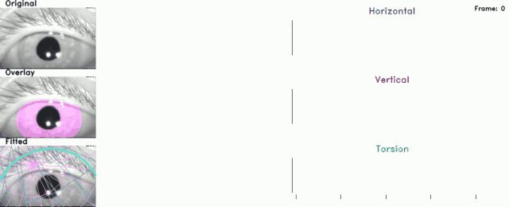

# 3DeepVOG (v2.0.0)

**3DeepVOG** is an open-source deep learning framework for **real-time 3D monocular eye tracking**, estimating **horizontal, vertical, and torsional eye movements** from standard video-oculography (VOG) recordings.

The system is designed for **clinical and research applications**, providing accurate and robust eye-movement quantification under diverse imaging conditions.

---

## 📄 Paper

**3DeepVOG: An Open-Source Framework for Real-Time, Accurate 3D Gaze Tracking with Deep Learning**  
*Digital Biomarkers*, 2025  (https://doi.org/10.1159/000549948)

### Citation
Zhao J, Ahmadi S-A, Decker J, Möhwald K, zu Eulenburg P, Zwergal A,
Flanagin VL, Wuehr M.
3DeepVOG: An Open-Source Framework for Real-Time, Accurate 3D Gaze
Tracking with Deep Learning.
Digital Biomarkers. 2025.
https://doi.org/10.1159/000549948


## Paper Abstract

**Objective**: Eye movements are key biomarkers for diagnosing and monitoring neuro-otological, neuro-ophthalmological and neurodegenerative disorders. Apparative video-oculography (VOG) systems afford the detection and quantification of small-amplitude and rapid eye movements, as well as subtle oculomotor pathologies that may not be evident during clinical examination. However, these systems typically require high-quality input data for accurate pupil tracking and often show limited reliability in capturing torsional movements. High system costs further constrain their use in broader clinical and research contexts.

**Methods**: To overcome these limitations, we developed **3DeepVOG**, a deep learning-based framework for **three-dimensional monocular eye tracking** (horizontal, vertical, and torsional rotation) designed to operate robustly across varied imaging conditions, including low-light and noisy environments. The method includes automated framewise segmentation of the pupil and iris from video frames, followed by geometrically interpretable gaze estimation based on a two-sphere anatomical eyeball model incorporating corneal refraction correction. Torsion is tracked in real time using a mini-iris-patch template matching approach. The system was trained on over **24,000 annotated samples** obtained across multiple devices and clinical scenarios. Application was tested against a gold-standard VOG system in healthy controls.

**Results**: 3DeepVOG operates in real time (>300 fps) and achieves mean gaze errors of approximately **0.1°** in all three motion dimensions. Derived oculomotor metrics – such as **saccadic peak velocity**, **smooth pursuit gain**, and **optokinetic nystagmus slow-phase velocity** – show good-to-excellent agreement with results from a clinical gold-standard system.

**Conclusions**: 3DeepVOG enables accurate, quantitative eye movement tracking across three dimensions under diverse conditions. As an open-source framework, it provides an accessible and scalable tool for advancing research and clinical assessment in neurological oculomotor disorders.

---

## Features

- 3D gaze estimation: horizontal, vertical, torsional  
- Deep learning-based segmentation of pupil & iris  
- Real-time processing (>300 fps)  
- Robust to low-light & noisy video  
- Validated against the clinical gold-standard VOG system  
- Open-source & extensible  

---

## ⚠️ Current Status

- Actively under development
- No user-friendly CLI or GUI yet (script-based usage)
- Tested on:
  - GPU (NVIDIA GeForce RTX 4090)
  - CPU (AMD Ryzen 9 7950X3D)
- Apple Silicon (MPS) not tested
- Developed and tested on Windows 11
- Python version: 3.11
- OS: Windows / Linux

## Installation
```bash
git clone https://github.com/DSGZ-MotionLab/3DeepVOG.git
cd 3DeepVOG

# (optional but recommended) create a virtual environment
python -m venv venv
venv\Scripts\activate
pip install --upgrade pip
pip install -r requirements.txt
```
All dependencies are listed in requirements.txt.

## How to Run
Currently, the system is configured via script editing.
1) Open run.py
2) Modify the args dictionary:
```bash
args["pred_vid"] = "path/to/your/video.mp4"  # monocular VOG video
args["device"] = "cuda"  # or "cpu" if GPU is not available
```
Optional Calibration: If you have a separate calibration video recorded from the same subject and session (with large eye movements), specify:
```bash
args["fit_vid"] = "path/to/calibration_video.mp4"
```
This typically improves eyeball fitting and gaze estimation accuracy.

## Camera Parameters
	•	Using known camera intrinsics (focal length, sensor size) is strongly recommended
	•	Incorrect camera parameters may lead to:
	•	Wrong eyeball center estimation
	•	Failure of corneal refraction correction in pye3d
	•	Manual tuning of focal length may be required if intrinsics are unknown

## Analysis Options
gaze_tracking_flag     # estimate horizontal & vertical gaze
torsion_tracking_flag  # estimate torsional eye movements
seg_video_flag         # visualize segmentation video
fit_video_flag         # visualize eyeball fitting (slower)

## Output Structure
```bash
log/
├── fit/
│   ├── ellipse.pkl
│   └── model_params.json
└── predict/
    ├── ellipse.pkl
    └── model_params.json
```
    
## License
This project is licensed under the Apache License Version 2.0.

## Acknowledgements
Developed at LMU Klinikum
Clinical Open Research Engine (CORE)
Supported by the German Space Agency (DLR) on behalf of the Federal Ministry of Economics and Technology/Energy (50WB2236) and by the German Federal Ministry of Education and Research (13GW0490B).

## Contact
For questions or collaborations:
E-mail: Jingkang.Zhao@med.uni-muenchen.de
